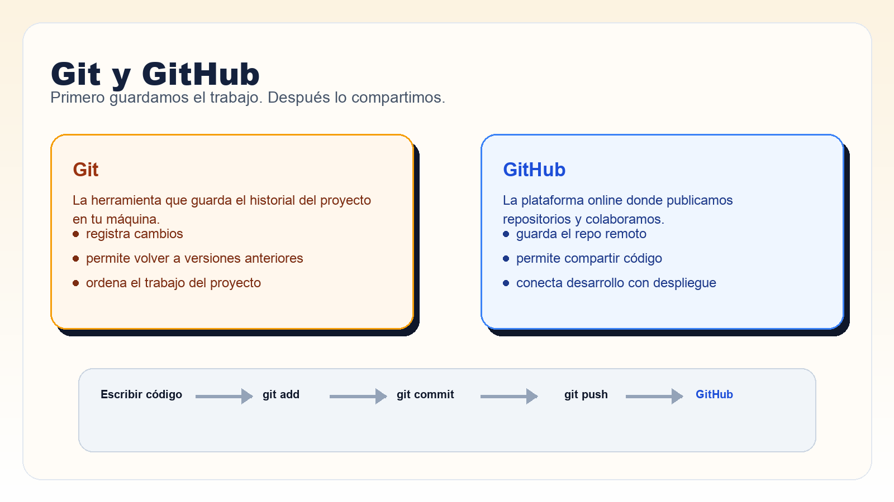
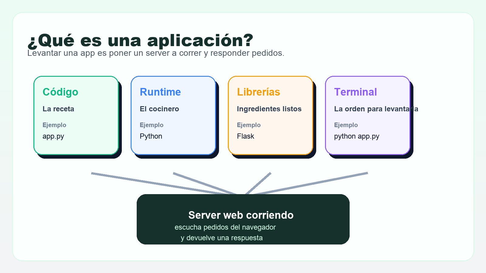
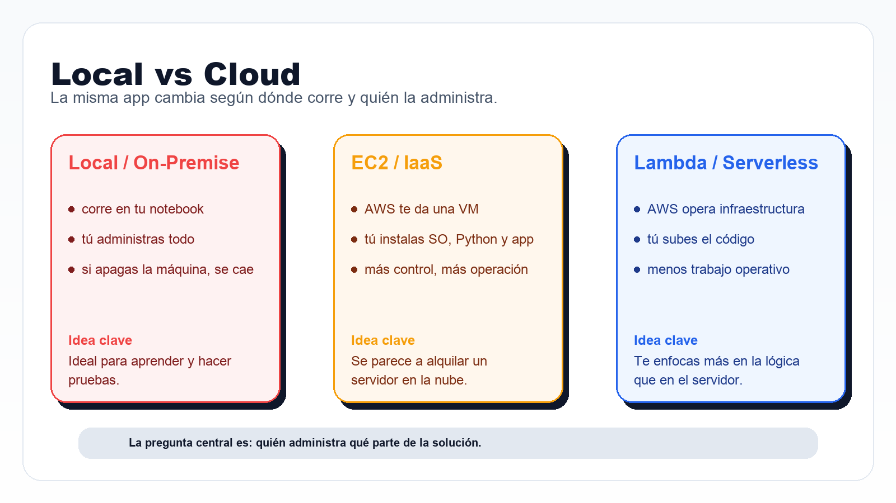
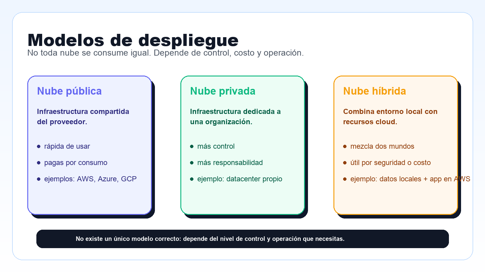

# Clase 2: Fundamentos de Cloud y Modelos de Despliegue

Este repositorio es el material de trabajo para alumnos de la clase 2.

La idea de la clase es seguir este orden:

1. Terminal: cómo hablar con la computadora.
2. Git y GitHub: dónde guardamos el código.
3. Qué es una aplicación: qué piezas necesita para funcionar.
4. Demo local: ejecutar una app simple en la notebook.
5. Cloud: qué cambia cuando queremos desplegar esa app fuera de nuestra máquina.

## Objetivos

Al terminar esta clase deberías poder:

- usar la terminal para moverte y ejecutar comandos básicos
- explicar para qué sirven Git y GitHub
- entender qué es una aplicación y qué necesita para correr
- ejecutar una app web mínima en Python con Flask
- distinguir entre `on-premise`, `IaaS` y `Serverless`
- entender la diferencia entre nube pública, privada e híbrida

## Estructura del repositorio

```text
.
├── app.py
├── lambda/
│   └── lambda_function.py
├── requirements.txt
├── .gitignore
└── README.md
```

## 1. Terminal primero

Antes de correr una app o usar Git, necesitamos una forma de hablar con la computadora.

La `terminal` es una ventana donde escribimos comandos de texto.

En esta clase la usamos para:

- ver archivos
- movernos entre carpetas
- ejecutar programas
- instalar dependencias
- correr la aplicación

### Comandos básicos

```bash
pwd
ls
cd nombre-de-carpeta
python app.py
```

### Explicación simple

- `pwd` muestra en qué carpeta estás
- `ls` muestra qué archivos hay
- `cd` te mueve a otra carpeta
- `python app.py` ejecuta el programa

## 2. Git y GitHub

Antes de hablar de cloud, primero necesitamos un lugar profesional para guardar el código.

- `Git` guarda el historial de cambios del proyecto.
- `GitHub` es la plataforma donde publicamos y compartimos ese código.

Piensa esta diferencia así:

- `Git` es el historial de versiones.
- `GitHub` es el almacén online del proyecto.

### Infograma



### Comandos básicos de Git

```bash
git init
git add .
git commit -m "Mi primera app"
git log --oneline --graph --all
```

## 3. ¿Qué es una aplicación?

Una aplicación no es solamente el archivo de código.

Para que una app funcione, necesitamos varias piezas:

- `Código`: las instrucciones que escribimos.
- `Runtime`: el programa que entiende ese lenguaje.
- `Librerías`: componentes ya hechos que reutilizamos.
- `Terminal`: la forma de darle órdenes a la computadora.

### ¿Qué significa "levantar una app"?

Levantar una app significa ponerla a correr.

En esta clase, levantar la app significa:

- ejecutar el archivo con Python
- dejar un programa funcionando
- hacer que ese programa espere pedidos desde el navegador

### ¿Qué es un server?

Un `server` o `servidor` es un programa que queda escuchando pedidos.

Explicado simple:

1. Abres el navegador.
2. El navegador hace un pedido.
3. El server recibe ese pedido.
4. El server responde con una página o un dato.

En nuestro ejemplo:

- `python app.py` levanta la aplicación
- Flask crea un pequeño `server web`
- ese server escucha en el puerto `5000`
- cuando entras desde el navegador, devuelve la respuesta

La idea corta es esta:

- `app.py` contiene las instrucciones
- Python las ejecuta
- Flask deja el server esperando pedidos
- el navegador se conecta y recibe una respuesta

### Analogía de cocina

- La aplicación es la receta.
- El runtime es el cocinero.
- Las librerías son ingredientes o preparaciones ya resueltas.
- La terminal es la forma de pedirle al cocinero que trabaje.

### Infograma



## 4. Nuestra app de ejemplo

Este repositorio trae una app mínima con Flask.

Archivo principal: `app.py`

```python
from flask import Flask

app = Flask(__name__)

@app.route("/")
def home():
    return "<h1>¡Hola Clase de Cloud!</h1><p>Servidor funcionando en local.</p>"

if __name__ == "__main__":
    app.run(host="0.0.0.0", port=5000)
```

Qué hace esta app:

- crea un pequeño servidor web
- escucha pedidos en el puerto `5000`
- responde con una página HTML simple

## 5. Ejecutar la app en local

### Paso 1: ver dónde estás

```bash
pwd
ls
```

### Paso 2: crear entorno virtual

```bash
python3 -m venv .venv
source .venv/bin/activate
```

### Paso 3: instalar dependencias

```bash
pip install -r requirements.txt
```

### Paso 4: ejecutar la app

```bash
python app.py
```

Luego abre:

```text
http://127.0.0.1:5000
```

## 6. Qué aprendemos de esta demo local

Si la app corre en tu notebook, eso no significa que ya esté lista para producción.

Significa solamente que:

- el código funciona
- el runtime está instalado
- las librerías están presentes
- la máquina local está haciendo todo el trabajo

### Conclusión

Esto es `on-premise`:

- la app vive en tu máquina
- si apagas la notebook, el servicio desaparece
- tú administras el entorno completo

### Infograma



## 7. Entonces, ¿qué problema resuelve cloud?

Cloud aparece cuando queremos que la aplicación:

- no dependa de una notebook personal
- pueda crecer
- tenga un despliegue más profesional
- reduzca trabajo manual según el modelo elegido

## 8. EC2 vs Lambda

Vamos a comparar dos experiencias en AWS.

### A. EC2: IaaS

En `IaaS`, AWS te alquila infraestructura.

Tú sigues administrando:

- sistema operativo
- runtime
- dependencias
- aplicación
- parte de la seguridad del sistema

Experiencia típica:

1. Crear una instancia.
2. Entrar por `ssh`.
3. Instalar `python3`.
4. Instalar dependencias.
5. Ejecutar la app.

### B. Lambda: Serverless

En `Serverless`, AWS administra mucha más infraestructura por ti.

Tú te enfocas sobre todo en:

- el código
- la lógica
- la configuración de la función

Ejemplo mínimo en este repo:

`lambda/lambda_function.py`

```python
def lambda_handler(event, context):
    return {
        "statusCode": 200,
        "headers": {"Content-Type": "text/html; charset=utf-8"},
        "body": "<h1>¡Hola Clase de Cloud!</h1><p>Servidor funcionando en AWS Lambda.</p>",
    }
```

### Infograma


## 9. Modelos de despliegue

| Modelo | Qué significa | Ejemplo |
|---|---|---|
| `Nube pública` | Usas infraestructura compartida del proveedor | AWS |
| `Nube privada` | Infraestructura dedicada para una sola organización | Datacenter propio |
| `Nube híbrida` | Mezcla de infraestructura local y nube | Base local + app en AWS |

### Infograma



## 10. Protección de cuenta en AWS

Antes de crear recursos en AWS:

1. Ir a `Billing & Cost Management`
2. Entrar en `Budgets`
3. Crear un `Cost Budget`
4. Definir `1.00 USD`
5. Crear alerta al `80%`

Regla de arquitectura:

- primero controlamos costo
- después desplegamos

## 11. Machete de comandos

| Comando | Para qué sirve |
|---|---|
| `pwd` | Ver la carpeta actual |
| `ls` | Ver archivos |
| `cd` | Entrar a una carpeta |
| `python app.py` | Ejecutar la app |
| `pip install -r requirements.txt` | Instalar dependencias |
| `git add .` | Preparar cambios |
| `git commit -m "mensaje"` | Guardar un cambio en la historia |
| `git log --oneline --graph --all` | Ver la historia del repositorio |

## 12. Ideas clave para llevarse

- La terminal es la herramienta base para trabajar con la app.
- GitHub aparece antes que cloud porque primero necesitamos guardar y compartir el código.
- Una app no es solo código: necesita runtime, librerías y un entorno de ejecución.
- Una app local sirve para aprender, pero no resuelve disponibilidad ni escalabilidad.
- Cloud consiste en decidir quién administra qué.
- EC2 y Lambda no son lo mismo: cambian el control y la carga operativa.
